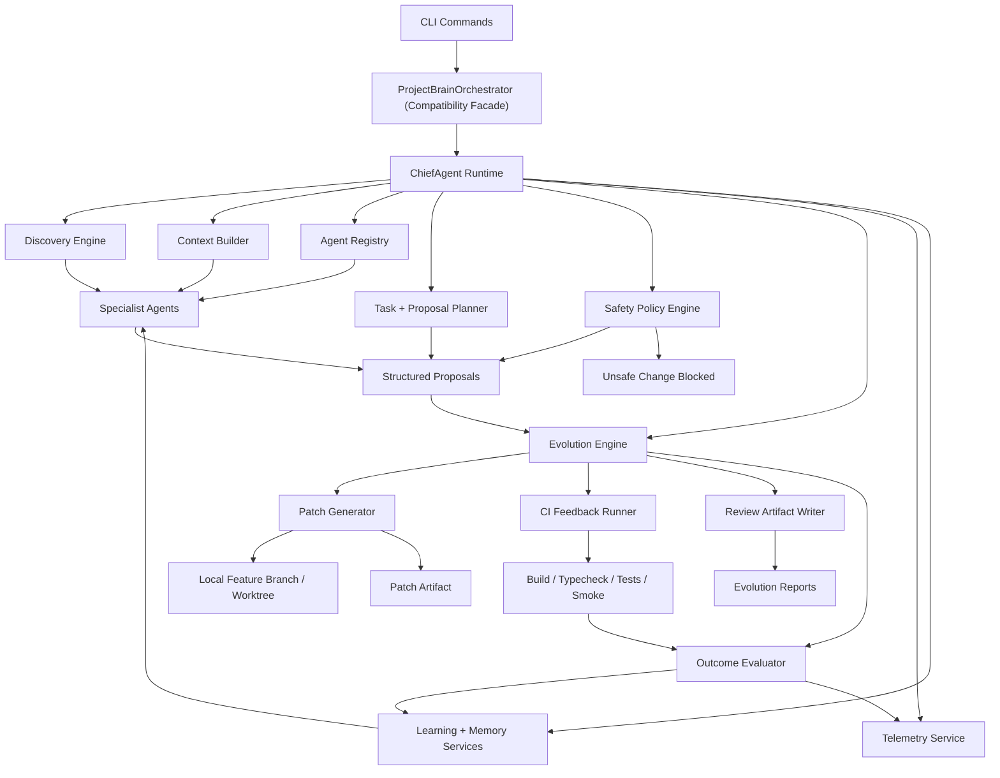

# Evolution Architecture V2

## Purpose

This document defines the v2 target architecture for turning `project-brain` into a controlled autonomous improvement engine without modifying external repositories automatically or expanding autonomy into unsafe areas.

The v2 runtime must replace the current report-only pipeline with a bounded execution loop:

`Analyze -> Propose -> Patch -> Test -> Evaluate -> Learn`

The scope of this document is the `project-brain` repository only.

## Non-negotiable constraints

- Work only inside `project-brain`.
- Do not modify any external repository automatically.
- Preserve the current CLI surface.
- Keep autonomy bounded to safe improvement classes.
- Never push automatically.
- Never deploy automatically.
- Never modify backend critical logic automatically.
- Every generated patch must go through review.

## Problems v2 must solve

The audit established that v1 has these blockers:

- `ChiefAgent` is not the real runtime coordinator.
- proposals stop at markdown and never become validated patch artifacts.
- learning records are weak and do not shape future behavior meaningfully.
- observability is coarse and partially inaccurate.
- governance is descriptive, not execution-enforcing.
- the multi-agent model is centralized and mostly non-interactive.

V2 must solve those without breaking current command usage.

## Target runtime

### Effective runtime flow

The target runtime flow is:

`CLI -> ChiefAgent -> Agents -> EvolutionEngine`

For backward compatibility, the existing `ProjectBrainOrchestrator` class should remain as a compatibility facade during migration, but it must delegate into `ChiefAgent` rather than own the end-to-end flow itself.

### Updated architecture diagram



## Design principles

### 1. Safety before autonomy

V2 is not allowed to become a blind auto-fixer. It may generate and validate patch artifacts only within explicit safe scopes.

### 2. Structured state over markdown state

Markdown remains a reporting output, not the internal control model. Internal execution must use structured proposal, patch, validation, and learning records.

### 3. Deterministic tools before model inference

Discovery, patch generation, validation, and policy enforcement should be deterministic first. Any future model integration must be grounded by these outputs.

### 4. ChiefAgent is the real control plane

V2 must make `ChiefAgent` the actual runtime coordinator, not a vestigial abstraction.

### 5. Learning must come from outcomes

Proposal quality cannot improve from self-authored scores alone. It must improve from validated patch results and explicit review outcomes.

## New module structure

```text
project-brain/
  core/
    chief_agent/
      index.ts
      cycle-controller.ts
      proposal-merger.ts
      safety-gate.ts
      priority-engine.ts
    evolution_engine/
      index.ts
      evolution-cycle.ts
      proposal-normalizer.ts
      patch-planner.ts
      outcome-evaluator.ts
      review-stage.ts
    ci_feedback/
      index.ts
      local-validator.ts
      result-parser.ts
      feedback-recorder.ts
  tools/
    patch_generator/
      index.ts
      branch-manager.ts
      patch-builder.ts
      scope-classifier.ts
      file-guards.ts
  memory/
    learning_store/
      index.ts
      outcome-memory.ts
      agent-adjustments.ts
  analysis/
    metrics/
      metrics_collector.ts
      evolution_metrics.ts
  reports/
    templates/
      evolution_cycle.md
      patch_results.md
      agent_performance.md
```

## Core responsibilities

## 1. `core/chief_agent/`

`ChiefAgent` becomes the real coordinator.

Responsibilities:

- load repository scope and context
- schedule the correct agents for the trigger
- provide agents with memory-informed context
- collect agent findings and structured proposals
- merge overlapping proposals
- prioritize safe improvements
- block unsafe proposals before patch generation
- hand approved structured proposals to `EvolutionEngine`
- emit cycle-level summaries and metrics

Required subcomponents:

- `cycle-controller.ts`: owns per-cycle state and removes the current long-lived mutable runtime problem
- `proposal-merger.ts`: deduplicates or merges similar agent proposals
- `safety-gate.ts`: blocks unsafe operations before patch generation
- `priority-engine.ts`: ranks proposals by value, safety, confidence, and past success rate

### ChiefAgent cycle contract

Input:

- trigger
- repository target
- output path
- prior learning summary

Output:

- structured cycle summary
- proposal set
- blocked proposal set
- evolution outcomes
- new reports

## 2. `core/evolution_engine/`

This is the missing execution loop.

Responsibilities:

- accept structured proposals from `ChiefAgent`
- transform proposals into patch plans
- invoke patch generation only for safe scopes
- run validation through `core/ci_feedback`
- classify outcomes
- record learnings
- write review artifacts and reports

### EvolutionEngine main flow

1. accept normalized proposals
2. classify each proposal by scope and risk
3. reject or defer unsafe proposals
4. create patch jobs for safe proposals
5. generate local branch or worktree and patch artifact
6. run build, typecheck, tests, and smoke checks
7. evaluate outcome
8. update learning store
9. produce review-ready results

### Required records

The engine must emit durable records for:

- proposal
- patch
- validation result
- outcome
- review status

## 3. `tools/patch_generator/`

This module should be deterministic and policy-restricted.

Responsibilities:

- create local feature branches or isolated worktrees
- generate git patch artifacts
- stage safe modifications
- refuse unsafe file classes
- never push
- never open remote pull requests automatically

### Safe scopes for automatic patch generation

Allowed:

- frontend UI changes
- documentation changes
- configuration updates
- test additions
- non-critical observability improvements

Blocked by default:

- database schema changes
- authentication and authorization logic
- financial logic
- deployment pipelines
- infrastructure provisioning
- backend critical business rules

### Required helpers

- `scope-classifier.ts`: determines whether a proposal is `frontend`, `docs`, `config`, `tests`, `backend-critical`, or `blocked`
- `file-guards.ts`: prevents writes to blocked paths or blocked diff classes
- `branch-manager.ts`: creates predictable local branches such as `codex/evolution/<cycle>/<proposal>`
- `patch-builder.ts`: writes patch files and staged working tree changes

## 4. `core/ci_feedback/`

This module closes the validation gap.

Responsibilities:

- run local validation commands
- capture build, typecheck, test, lint, and smoke status
- normalize results into structured records
- feed outcomes into learning and telemetry

### Validation policy

Minimum checks for safe patch classes:

- `build` if available
- `typecheck` if available
- unit or integration tests if available
- smoke tests when supported by the repo

Validation should be capability-driven. If a repo lacks a tool, that absence must be recorded, not silently ignored.

### Required outputs

- command run list
- exit codes
- stdout/stderr artifact references
- tests passed / tests failed
- validation summary per patch

## 5. `memory/learning_store/`

The current learning store is too weak. V2 must upgrade it from general observations to outcome-linked execution memory.

### Required learning entry shape

Each learning entry must store:

- `proposal_id`
- `patch_id`
- `result` (`success` or `failure`)
- `tests_passed`
- `impact_estimate`
- `confidence_adjustment`

It should also retain:

- `agent_id`
- `task_id`
- `scope`
- `risk_level`
- `blocked_reason` when relevant
- `created_at`

### New responsibilities

- maintain outcome history by agent and proposal class
- compute confidence adjustments from actual outcomes
- expose agent-level success rates by scope
- expose failure clusters by file type, repo type, and validation step

### Agent behavior adjustment

Agents must adapt future proposals using outcome memory:

- reduce confidence for proposal classes with repeated failures
- increase confidence for proposal classes with repeated success
- deprioritize scopes with low validation pass rate
- highlight proposal templates that perform well for a given repo type

This should begin with deterministic adjustment rules before any future model tuning.

## Proposal, patch, and outcome model

V2 should add typed records in shared types or a new evolution types module.

### `StructuredProposal`

Required fields:

- `proposalId`
- `sourceAgentIds`
- `title`
- `summary`
- `scope`
- `targetFiles`
- `riskLevel`
- `safeToPatch`
- `blockedReason`
- `expectedBenefit`
- `confidence`
- `patchStrategy`

### `PatchArtifact`

Required fields:

- `patchId`
- `proposalId`
- `branchName`
- `patchFilePath`
- `targetFiles`
- `scope`
- `createdAt`
- `appliedLocally`
- `reviewStatus`

### `ValidationResult`

Required fields:

- `patchId`
- `buildPassed`
- `typecheckPassed`
- `testsPassed`
- `smokePassed`
- `failedSteps`
- `commandResults`
- `durationMs`

### `EvolutionOutcome`

Required fields:

- `proposalId`
- `patchId`
- `result`
- `testsPassed`
- `impactEstimate`
- `confidenceAdjustment`
- `agentAccuracyScoreDelta`
- `recordedAt`

## Safety guardrails

V2 must enforce these as runtime policy, not report text.

### Hard blocks

Agents may not automatically:

- modify database schemas
- modify authentication or authorization
- modify financial logic
- deploy code
- push directly to `main`
- push to any remote automatically

### Review stage rules

Every patch, even successful ones, must pass through a review stage.

Review artifacts must include:

- proposal summary
- affected files
- patch path
- validation summary
- safety classification
- blocked reasons if applicable

### Allowed autonomous classes

Initial v2 autonomous patch classes:

- docs
- frontend presentation
- configuration hardening
- test baseline additions
- low-risk observability changes outside critical backend logic

### Required policy behavior

If a proposal touches both safe and unsafe areas, the entire patch job is blocked and emitted as review-only.

## Observability upgrade

Extend `analysis/metrics/metrics_collector.ts` with v2 metrics:

- `proposals_generated`
- `patches_applied`
- `patch_success_rate`
- `agent_accuracy_score`
- `learning_updates`

Additional recommended metrics:

- blocked proposal count
- safe proposal count
- validation duration
- validation failure rate by step
- patch success rate by scope
- agent proposal acceptance rate by scope

### Metric ownership

- `ChiefAgent`: cycle-level planning metrics
- `EvolutionEngine`: proposal-to-patch and patch-to-outcome metrics
- `CI Feedback`: validation metrics
- `LearningStore`: learning update metrics

## New report types

V2 must generate:

- `reports/evolution_cycle.md`
- `reports/patch_results.md`
- `reports/agent_performance.md`

### `evolution_cycle.md`

Should contain:

- cycle trigger and target
- proposals received
- proposals blocked
- patches generated
- validations run
- success/failure summary
- learning updates applied

### `patch_results.md`

Should contain:

- patch ID to proposal ID mapping
- branch names
- files changed
- validation results
- blocked patches
- review status

### `agent_performance.md`

Should contain:

- proposals per agent
- successful patch rate per agent
- blocked rate per agent
- confidence adjustments
- agent accuracy trend

## Backward compatibility with the current CLI

The current command surface must remain intact:

- `init`
- `analyze`
- `agents`
- `weekly`
- `report`
- `feedback`

### Compatibility strategy

#### Phase 1

Keep `ProjectBrainOrchestrator` as a facade, but change its responsibilities:

- delegate planning and execution to `ChiefAgent`
- stop owning governance-heavy flow directly
- continue returning the current result shapes where possible

#### Phase 2

Extend result types with optional v2 fields:

- `evolutionReportPath`
- `patchResultsPath`
- `agentPerformancePath`
- `proposalCount`
- `patchCount`
- `blockedCount`

#### Phase 3

Add new CLI output lines, but do not remove existing ones. Example:

- `Evolution report: ...`
- `Patch results: ...`
- `Agent performance: ...`

This keeps scripts and current human usage stable.

## Migration from current architecture

### Current runtime

`CLI -> ProjectBrainOrchestrator -> AgentSelfGovernanceSystem`

### Target runtime

`CLI -> ProjectBrainOrchestrator (compat) -> ChiefAgent -> EvolutionEngine`

### Migration steps

#### Step 1. Stabilize cycle boundaries

- move per-cycle state out of long-lived governance instances
- eliminate accumulated execution records
- make each cycle allocate fresh state containers

#### Step 2. Promote `ChiefAgent` into the real runtime coordinator

- move scheduling, selection, and cycle control into `core/chief_agent/`
- make orchestrator delegate to it
- keep old method names for compatibility

#### Step 3. Introduce structured proposals

- stop treating recommendations as the only proposal representation
- normalize agent outputs into `StructuredProposal`

#### Step 4. Add `EvolutionEngine`

- convert safe structured proposals into patch jobs
- defer unsafe ones to review-only

#### Step 5. Add `PatchGenerator`

- create local branch/worktree support
- build patch files
- enforce path and scope guards

#### Step 6. Add `CI Feedback`

- run local validations
- capture structured results
- store outcomes

#### Step 7. Upgrade learning store

- add proposal-to-patch-to-outcome linkage
- add confidence adjustment logic
- surface agent accuracy metrics

#### Step 8. Extend observability and reporting

- add new evolution metrics
- add evolution reports
- keep existing reports during transition

#### Step 9. Retire or demote v1 governance-only paths

- keep `AgentSelfGovernanceSystem` only as a legacy adapter during transition
- eventually split reusable parts into `ChiefAgent` and policy modules

## Implementation plan

## Phase A. Architecture alignment

Goal:

Make runtime architecture honest before adding execution.

Tasks:

- create `core/chief_agent/`
- move cycle orchestration into `ChiefAgent`
- make `ProjectBrainOrchestrator` a facade
- isolate per-run mutable state
- define new evolution types

Exit criteria:

- runtime path effectively goes through `ChiefAgent`
- current CLI still works
- telemetry is per-cycle accurate

## Phase B. Structured proposal pipeline

Goal:

Convert agent recommendations into executable-safe proposal records.

Tasks:

- define `StructuredProposal`
- add proposal normalization in `ChiefAgent`
- add proposal merging and prioritization
- add safety classification and blocked-reason handling

Exit criteria:

- every candidate change is typed and classified before patch generation

## Phase C. Safe patch generation

Goal:

Generate local, review-only patch artifacts for safe scopes.

Tasks:

- create `tools/patch_generator/`
- add branch or worktree creation
- generate patch files
- refuse blocked scopes
- support frontend/docs/config/test-safe changes

Exit criteria:

- safe proposals become local patch artifacts
- unsafe proposals never become applied changes

## Phase D. CI feedback loop

Goal:

Validate generated patches and capture outcomes.

Tasks:

- create `core/ci_feedback/`
- run build/typecheck/test/smoke pipelines
- normalize results
- attach results to patches and proposals

Exit criteria:

- every generated patch has a validation record

## Phase E. Learning loop

Goal:

Make agents adapt future confidence from outcomes.

Tasks:

- upgrade `memory/learning_store/`
- store proposal and patch IDs
- compute confidence adjustments
- expose agent accuracy and success rates to `ChiefAgent`

Exit criteria:

- proposal ranking changes based on actual prior success/failure

## Phase F. Evolution reports and metrics

Goal:

Make autonomous improvement behavior observable.

Tasks:

- extend metrics collector with v2 metrics
- generate `evolution_cycle.md`
- generate `patch_results.md`
- generate `agent_performance.md`

Exit criteria:

- each cycle explains what was proposed, attempted, blocked, validated, and learned

## Safe initial rollout policy

V2 should launch in three operating modes:

### `analyze-only`

- current behavior
- no patch jobs
- no validation loop

### `review-ready`

- generates structured proposals and patch artifacts
- runs validation
- never applies staged changes to external repos outside local review artifacts

### `bounded-autonomous`

- only for explicitly allowed safe scopes
- still review-gated
- no remote actions

The default should remain the equivalent of `analyze-only` until Phases A through F are complete.

## Recommended first implementation slice

The smallest useful v2 slice is:

1. make `ChiefAgent` real
2. add `StructuredProposal`
3. add `EvolutionEngine` as review-only
4. add `CI Feedback` validation records
5. upgrade learning entries with proposal and patch outcomes

That produces a real improvement loop without yet expanding autonomy too far.

## Final architectural verdict

`project-brain` should not jump directly from report generation to self-directed repo modification.

The correct v2 path is:

- centralize control in `ChiefAgent`
- formalize proposal state
- generate only safe local patches
- validate every patch
- learn from outcomes
- require review for every patch

If implemented in that order, `project-brain` can evolve from a repository analysis framework into a controlled autonomous improvement engine without abandoning its current safety posture.
