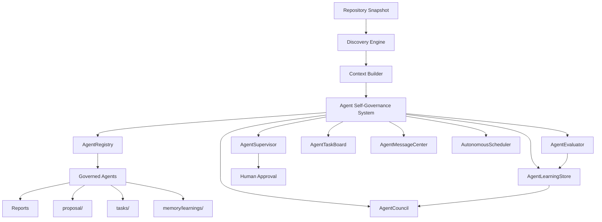

# Agent Self-Governance System

## Scope

This document describes the practical self-governance layer implemented for `project-brain`.

It is built around these concrete modules:

- [governance/self-governance-system.ts](/Users/ruzer/ProyectosLocales/Agentes/governance/self-governance-system.ts)
- [governance/agent-registry.ts](/Users/ruzer/ProyectosLocales/Agentes/governance/agent-registry.ts)
- [governance/agent-council.ts](/Users/ruzer/ProyectosLocales/Agentes/governance/agent-council.ts)
- [governance/agent-supervisor.ts](/Users/ruzer/ProyectosLocales/Agentes/governance/agent-supervisor.ts)
- [governance/agent-evaluator.ts](/Users/ruzer/ProyectosLocales/Agentes/governance/agent-evaluator.ts)
- [governance/task-board.ts](/Users/ruzer/ProyectosLocales/Agentes/governance/task-board.ts)
- [governance/message-center.ts](/Users/ruzer/ProyectosLocales/Agentes/governance/message-center.ts)
- [memory/learnings/index.ts](/Users/ruzer/ProyectosLocales/Agentes/memory/learnings/index.ts)

The system never modifies production code automatically. Agents only analyze, propose, and report.

## 1. Architecture Diagram



## 2. Directory Structure

### Source code

```text
project-brain/
  governance/
    agent-council.ts
    agent-evaluator.ts
    agent-registry.ts
    agent-supervisor.ts
    autonomous-scheduler.ts
    message-center.ts
    self-governance-system.ts
    task-board.ts
  memory/
    learnings/
      index.ts
  agents/
    architecture_agent/
    dependency_agent/
    product_owner_agent/
    catalog.ts
```

### Runtime artifacts generated per analyzed repository

```text
<output>/
  AI_CONTEXT/
  reports/
    agent_activity_report.md
    improvement_report.md
    risk_report.md
  tasks/
    backlog.json
    active.json
    completed.json
    messages.json
  memory/
    learnings/
      index.json
      <timestamp>.json
  proposal/
    improved_security_rules.md
    improved_architecture_analysis.md
    improved_<agent>.md
```

## 3. Runtime Flow

1. Discovery scans the repository and builds normalized context.
2. `AgentSelfGovernanceSystem` loads previous learnings from `memory/learnings/`.
3. `AutonomousScheduler` selects agents based on the trigger.
4. `AgentCouncil` creates prioritized tasks.
5. `AgentTaskBoard` persists `NEW` tasks to `tasks/backlog.json`.
6. `AgentMessageCenter` sends `QUESTION` messages from `AgentCouncil` to each agent.
7. `AgentSupervisor` validates safety rules and monitors execution.
8. Each agent runs and emits a report.
9. `AgentEvaluator` scores the output quality and ranks proposals.
10. `AgentMessageCenter` records `ANALYSIS_RESULT`, `PROPOSAL`, `FEEDBACK`, or `ESCALATION` messages.
11. `AgentSelfGovernanceSystem` derives learning records and writes evolution proposals.
12. Reports are generated in `reports/` and the task board is updated.
13. Human feedback can later move tasks to `APPROVED`, `REJECTED`, or `ARCHIVED` using the CLI `feedback` command.

## 4. Governance Rules

The active guardrails are enforced in [governance/agent-supervisor.ts](/Users/ruzer/ProyectosLocales/Agentes/governance/agent-supervisor.ts):

- agents cannot execute destructive operations
- agents cannot commit code
- agents cannot merge pull requests
- agents cannot deploy infrastructure
- agents can only analyze, propose, and report
- human approval is required for structural changes, architectural decisions, and security-sensitive proposals

## 5. Task Lifecycle

The shared task economy uses these states:

- `NEW`
- `ANALYZING`
- `PROPOSED`
- `APPROVED`
- `REJECTED`
- `ARCHIVED`

State model:

```text
NEW -> ANALYZING -> PROPOSED -> APPROVED
NEW -> ANALYZING -> PROPOSED -> REJECTED
NEW -> ANALYZING -> PROPOSED -> ARCHIVED
ANALYZING -> REJECTED
```

Persistence rules:

- `backlog.json` stores `NEW`
- `active.json` stores `ANALYZING` and `PROPOSED`
- `completed.json` stores `APPROVED`, `REJECTED`, and `ARCHIVED`

## 6. Example Agent Interactions

The message protocol is implemented through the `AGENT_MESSAGE` envelope in [shared/types.ts](/Users/ruzer/ProyectosLocales/Agentes/shared/types.ts).

Example interaction:

1. `AgentCouncil -> SecurityAgent`
   `QUESTION`: run security review for `weekly-review`
2. `SecurityAgent -> AgentCouncil`
   `ANALYSIS_RESULT`: high-risk secrets or lockfile findings
3. `AgentCouncil -> HumanApproval`
   `ESCALATION`: security-sensitive proposal requires approval
4. `QAAgent -> ProductOwnerAgent`
   `PROPOSAL`: test risk should influence backlog priority
5. `ArchitectureAgent -> DocumentationAgent`
   `FEEDBACK`: architecture findings should update docs

The live message log for a run is written to `tasks/messages.json`.

## 7. Example Learning Record

Example stored record shape:

```json
{
  "lessonId": "lesson_qa-agent_1773125259140_7vit5r",
  "agentId": "qa-agent",
  "taskId": "task_qa-agent_1773125247883_2",
  "context": "Weekly review validation",
  "detectedProblem": "No automated tests detected",
  "actionTaken": "Escalated smoke-test baseline proposal",
  "outcome": "SUCCESSFUL_PROPOSAL",
  "confidenceScore": 0.92,
  "createdAt": "2026-03-10T06:47:39.140Z"
}
```

Stored in:

- `memory/learnings/index.json`
- `memory/learnings/<timestamp>.json`

## 8. Example Proposal

Example evolution proposal generated by the self-governance runtime:

```md
# Improved Security Rules

## Source agent

- Agent: security-agent
- Task score: 0.78

## Proposed refinement

- Refine prompts and heuristics using the latest findings.
- Strengthen rules around secret leakage and lockfile coverage.
- Preserve safety constraints: analyze, propose, and report only.

## Human approval required

Yes. This proposal must be reviewed before activation.
```

Stored in:

- `proposal/improved_security_rules.md`
- `proposal/improved_architecture_analysis.md`
- `proposal/improved_<agent>.md`

## 9. Scheduling Model

The implemented trigger model supports:

- `manual`
- `repository-change`
- `weekly-review`
- `incident-detection`
- `dependency-update`
- `security-advisory`

Default cycles in [governance/autonomous-scheduler.ts](/Users/ruzer/ProyectosLocales/Agentes/governance/autonomous-scheduler.ts):

- daily: `security-agent`, `dependency-agent`
- weekly: `architecture-agent`, `optimization-agent`, `documentation-agent`

## 10. CLI Integration

Relevant commands:

```bash
project-brain analyze /path/to/repo --trigger weekly-review
project-brain agents /path/to/repo --trigger security-advisory
project-brain feedback /path/to/repo --agent qa-agent --task <taskId> --context "..." --problem "..." --action "..." --outcome SUCCESSFUL_PROPOSAL
```

## 11. Practical Outcome

This layer turns `project-brain` from a simple multi-agent analyzer into a governed agent ecosystem that can:

- register and supervise agents dynamically
- plan and prioritize work instead of running blindly
- communicate through structured messages
- persist learnings across runs
- generate self-improvement proposals for prompts, heuristics, and rules
- require human approval before any behavioral activation

It remains non-destructive by design.
