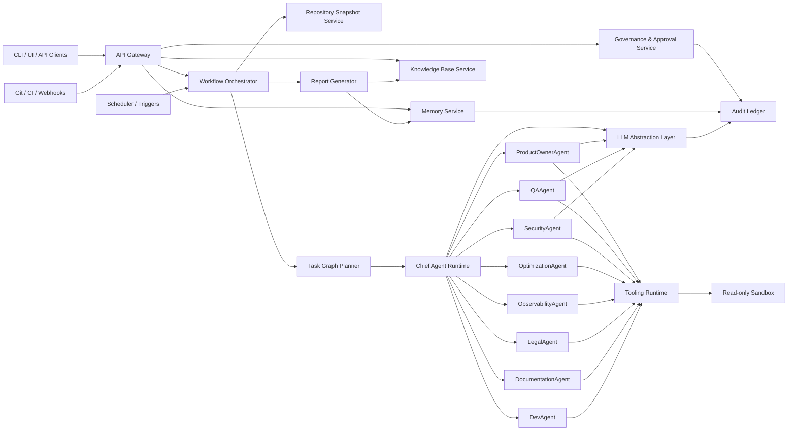

# Project-Brain Production Architecture Specification

## Status

- Document type: production implementation specification
- Baseline analyzed: current `project-brain` repository
- Target state: autonomous engineering intelligence platform for large-scale continuous software analysis

## 1. Current State Assessment

The current repository already has a usable foundation:

- CLI entrypoints in `cli/`
- repository discovery in `core/discovery_engine/`
- context generation in `core/context_builder/`
- orchestration in `core/orchestrator/`
- persistent Markdown memory in `memory/`
- specialist agents in `agents/`
- report generation into `reports/` and `docs/`

The current design is intentionally lightweight and non-destructive. It is effective for local execution, but it is not yet production-grade for continuous analysis at scale.

### Current strengths

- Clear modular boundaries between discovery, orchestration, memory, and agents
- Non-destructive operating model
- Practical CLI workflow
- Good conceptual mapping for specialist agents

### Current architectural limits

- Single-process execution
- Sequential agent execution
- No task graph or retry semantics
- No job queue or distributed workers
- No LLM provider abstraction
- File-only memory model
- No explicit approval workflow
- No sandbox boundary for tool execution
- No multi-tenant API or server mode
- No audit-grade event ledger

## 2. Production Goals

The production platform must:

- continuously analyze large repositories and monorepos
- support local mode and server mode
- run specialist agents in parallel under policy control
- isolate tool execution in read-only sandboxes
- persist durable knowledge and historical decisions
- support multiple LLM providers through a stable adapter layer
- integrate with CI/CD and event triggers
- require human approval for any proposed code change or external side effect
- expose auditable, role-aware workflows

## 3. Target Architecture Summary

The production architecture is a layered control-plane and worker-plane system:

- `Control Plane`: API, scheduler, workflow coordinator, policy engine, approval service
- `Worker Plane`: discovery workers, tool runners, agent workers, report workers
- `Memory Plane`: relational state, object storage, vector knowledge index, audit ledger
- `Integration Plane`: Git providers, CI/CD, webhooks, OpenAPI sources, observability backends
- `LLM Plane`: provider adapters for OpenAI and local/self-hosted models

The current repo should evolve from a single-package CLI project into a modular monorepo with shared contracts and separately deployable services.

## 4. Final Directory Structure

```text
project-brain/
  apps/
    cli/
    api/
    scheduler/
    worker/
    approval-console/
  packages/
    contracts/
      src/
        api/
        events/
        runtime/
        memory/
        agents/
    runtime/
      src/
        engine/
        loop/
        lifecycle/
        sandbox/
        orchestration/
        scheduling/
    agents/
      src/
        chief/
        product-owner/
        qa/
        security/
        optimization/
        observability/
        legal/
        documentation/
        dev/
        common/
    tools/
      src/
        git-analysis/
        openapi-validator/
        dependency-scanner/
        security-scanner/
        architecture-analyzer/
        performance-analyzer/
        common/
    llm/
      src/
        adapters/
          openai/
          ollama/
          vllm/
          lm-studio/
        routing/
        policies/
        prompts/
    memory/
      src/
        short-term/
        long-term/
        decision-log/
        error-history/
        knowledge-base/
        projections/
    governance/
      src/
        policy-engine/
        approvals/
        permissions/
        audit/
    integrations/
      src/
        git/
        github/
        gitlab/
        ci/
        webhooks/
        logs/
        metrics/
    reporting/
      src/
        renderers/
        templates/
        exporters/
    shared/
      src/
        config/
        logging/
        telemetry/
        utils/
  deploy/
    docker/
    helm/
    terraform/
  docs/
    architecture/
    operations/
    security/
  tests/
    integration/
    e2e/
    fixtures/
```

## 5. Component Diagram



## 6. Core Runtime

### 6.1 Runtime responsibilities

The runtime is the execution kernel of the system. It owns:

- job intake
- snapshot management
- task graph creation
- agent scheduling
- tool invocation
- policy enforcement
- retries and timeouts
- result persistence
- workflow completion state

### 6.2 Agent runtime loop

Each analysis job runs through a deterministic loop:

1. `INTAKE`
   Validate request, tenant policy, repo adapter, and execution profile.
2. `SNAPSHOT`
   Create immutable repository snapshot from Git ref, CI artifact, or local path.
3. `DISCOVERY`
   Run baseline discovery scanners and produce normalized repository facts.
4. `PLAN`
   Chief Agent builds a task graph from discovery facts, risk heuristics, and previous memory.
5. `DISPATCH`
   Runtime schedules specialist agent tasks onto worker queues.
6. `EXECUTE`
   Agents invoke approved tools inside read-only sandboxes and call LLM providers through policy-aware adapters.
7. `EVALUATE`
   Runtime validates outputs against schema, confidence thresholds, and policy constraints.
8. `APPROVAL`
   Any side-effecting recommendation or patch proposal is held behind human approval gates.
9. `PERSIST`
   Update short-term memory, long-term memory, decision log, error history, and knowledge base projections.
10. `REPORT`
   Generate artifacts, API payloads, and CI annotations.
11. `COMPLETE`
   Close workflow and emit audit events.

### 6.3 Task orchestration

Production orchestration should be workflow-based, not simple in-process sequencing.

Recommended model:

- `Workflow Engine`: Temporal
- `Queue`: Temporal task queues or NATS JetStream for externalized worker pools
- `Execution unit`: typed `AnalysisTask`
- `Strategy`: DAG-based scheduling with dependencies, concurrency limits, deadlines, and retry policies

Task types:

- snapshot tasks
- discovery tasks
- planner tasks
- specialist agent tasks
- aggregation tasks
- reporting tasks
- approval tasks

### 6.4 Agent lifecycle management

Every agent must implement the same lifecycle:

- `REGISTERED`
- `READY`
- `PLANNED`
- `RUNNING`
- `WAITING_FOR_TOOL`
- `WAITING_FOR_LLM`
- `WAITING_FOR_APPROVAL`
- `COMPLETED`
- `FAILED`
- `QUARANTINED`

Quarantine is required for:

- repeated malformed outputs
- policy violations
- excessive cost
- tool misuse
- confidence collapse

### 6.5 Execution sandbox

All analyzer and tool execution must occur in an isolated environment.

Recommended boundary:

- default: rootless containers
- hardened mode: `gVisor` or `Firecracker` microVM for untrusted repo content
- filesystem: read-only mount of repo snapshot
- temp workspace: scratch volume with TTL
- network: deny by default, allowlist per tool
- secrets: injected per-tool, per-task, never exposed to repo filesystem

## 7. Agent System

### 7.1 Chief Agent

The Chief Agent is not a generic chat orchestrator. It is a policy-bound planner and synthesizer.

Responsibilities:

- interpret repository state and historical memory
- create the task graph
- assign priorities and budgets
- select specialist agents
- merge findings
- escalate approval-required items
- publish the consolidated system judgment

Chief Agent output:

- execution plan
- task graph
- risk summary
- recommendation bundle
- approval bundle

### 7.2 Specialist agents

#### ProductOwnerAgent

- analyzes backlog signals, feature friction, missing product docs, release readiness, and workflow bottlenecks
- consumes architecture facts, API contracts, issue metadata, and usage heuristics
- produces product improvement proposals

#### QAAgent

- analyzes coverage, flaky areas, missing test layers, risky diffs, and contract-test gaps
- consumes repository structure, test inventory, CI history, and changed modules
- produces QA risk findings and test plans

#### SecurityAgent

- analyzes secrets exposure, dependency risk, image hygiene, auth surfaces, permission boundaries, and policy drift
- consumes repo snapshot, SBOM, IaC facts, dependency advisories, and secret scanner outputs
- produces security risks and remediations

#### OptimizationAgent

- analyzes dependency bloat, build performance, image size, query hot paths, and runtime inefficiencies
- consumes profiling artifacts, CI durations, dependency graphs, and container metadata
- produces optimization backlog

#### ObservabilityAgent

- analyzes logs, metrics, traces, alerts, runbooks, and SLO coverage
- consumes telemetry config, dashboards metadata, alert definitions, and instrumentation facts
- produces observability gaps and operational readiness report

#### LegalAgent

- analyzes licenses, dependency obligations, notices, privacy-sensitive data paths, and compliance documentation gaps
- consumes dependency manifests, notices, policy rules, and configured regions
- produces compliance updates and action items

#### DocumentationAgent

- generates architecture docs, API docs, runbooks, ADR summaries, and onboarding guides
- consumes normalized facts, approved findings, and knowledge base records
- produces human-readable documentation artifacts

#### DevAgent

- analyzes code structure, refactor candidates, maintainability risks, dead modules, and architecture drift
- consumes repository graph, complexity metrics, and previous technical decisions
- produces refactor proposals and engineering tasks

### 7.3 Agent execution policy

Each agent must declare:

- allowed tools
- allowed network domains
- maximum runtime
- maximum token budget
- required input schemas
- output schema
- confidence scoring policy
- approval requirements

## 8. Tooling Layer

The tooling layer must be explicit, typed, and policy-enforced. Tools are not arbitrary shell access.

### 8.1 Required production tools

- `GitAnalysisTool`
- `OpenApiValidatorTool`
- `DependencyScannerTool`
- `SecurityScannerTool`
- `ArchitectureAnalyzerTool`
- `PerformanceAnalyzerTool`

### 8.2 Tool responsibilities

#### GitAnalysisTool

- commit graph inspection
- ownership hotspots
- churn analysis
- risky file concentration
- branch and release metadata

#### OpenApiValidatorTool

- schema validation
- breaking change detection
- endpoint inventory
- version drift
- contract completeness scoring

#### DependencyScannerTool

- manifest parsing
- transitive dependency graph
- SBOM generation
- outdated packages
- duplicate dependency detection

#### SecurityScannerTool

- secret scanning
- vulnerable dependency enrichment
- IaC misconfiguration rules
- container hardening checks
- auth and permission surface heuristics

#### ArchitectureAnalyzerTool

- module graph extraction
- cycle detection
- bounded context inference
- layering rule violations
- service boundary mapping

#### PerformanceAnalyzerTool

- build-time analysis
- container size analysis
- hotspot heuristics
- query-pattern extraction
- optional profile artifact ingestion

### 8.3 Tool contract

```ts
export interface ToolDefinition<I, O> {
  id: string;
  version: string;
  readOnly: boolean;
  networkPolicy: "deny" | "allowlist";
  timeoutMs: number;
  inputSchema: JsonSchema;
  outputSchema: JsonSchema;
  execute(input: I, ctx: ToolExecutionContext): Promise<O>;
}
```

### 8.4 Tool execution rules

- Tool outputs must be schema-validated.
- Tools must return evidence references.
- No tool may write to the repo snapshot.
- Shell tools must run behind wrapper executors, never directly from agent prompts.

## 9. LLM Abstraction Layer

### 9.1 Objective

Separate reasoning logic from model vendor implementation.

### 9.2 Supported providers

- OpenAI
- local/self-hosted Llama-family models
- local/self-hosted DeepSeek-family models
- any OpenAI-compatible endpoint via adapter

### 9.3 Adapter architecture

Recommended adapters:

- `OpenAIAdapter`
- `OllamaAdapter`
- `VllmAdapter`
- `LmStudioAdapter`
- `OpenAICompatibleAdapter`

Provider router responsibilities:

- model selection by task type
- cost and latency policy
- fallback policy
- prompt redaction
- response schema enforcement
- token accounting

### 9.4 LLM contract

```ts
export interface LlmProvider {
  providerId: string;
  supportsResponsesApi: boolean;
  generate<T>(request: LlmRequest<T>): Promise<LlmResponse<T>>;
  embed(request: EmbeddingRequest): Promise<EmbeddingResponse>;
  health(): Promise<ProviderHealth>;
}
```

```ts
export interface LlmRequest<T> {
  taskType: "planning" | "analysis" | "synthesis" | "documentation";
  model: string;
  responseSchema: JsonSchema;
  messages: Array<{ role: "system" | "user" | "tool"; content: string }>;
  maxTokens: number;
  temperature: number;
  metadata: Record<string, string>;
}
```

### 9.5 Provider strategy

- OpenAI for high-precision planning, synthesis, and approval bundles
- local models for low-cost classification, summarization, and large-batch heuristics
- strict fallback path if a provider is unavailable or violates schema

## 10. Memory System

The memory system must move from Markdown-only persistence to a layered knowledge architecture.

### 10.1 Memory categories

#### Short-term memory

- per-job working memory
- task outputs
- intermediate facts
- TTL-based storage

Recommended storage:

- Redis for ephemeral state
- object storage for large artifacts

#### Long-term learning memory

- recurring patterns
- proven remediations
- project-specific heuristics
- architecture evolution summaries

Recommended storage:

- PostgreSQL plus pgvector

#### Decision log

- approved decisions
- rejected proposals
- rationale
- approver identity
- links to evidence

Recommended storage:

- PostgreSQL append-only table

#### Error history

- scanner failures
- policy violations
- tool crashes
- false positives
- reliability incidents

Recommended storage:

- PostgreSQL plus searchable log index

#### Knowledge base

- normalized architecture facts
- ADRs
- API contracts
- ownership maps
- runbooks
- historical reports

Recommended storage:

- object storage for canonical documents
- PostgreSQL metadata index
- pgvector embeddings for retrieval

### 10.2 Memory contract

```ts
export interface MemoryService {
  putFact(record: FactRecord): Promise<void>;
  appendDecision(record: DecisionRecord): Promise<void>;
  appendError(record: ErrorRecord): Promise<void>;
  queryKnowledge(query: KnowledgeQuery): Promise<KnowledgeResult[]>;
  getProjectState(projectId: string): Promise<ProjectState>;
}
```

### 10.3 Projection model

Persist raw events first, then build projections:

- current project profile
- current risk profile
- current architecture map
- current task backlog
- agent reliability scores

## 11. Continuous Analysis Engine

### 11.1 Scheduled analysis

Run recurring workflows:

- nightly incremental scan
- weekly deep scan
- monthly compliance scan

### 11.2 Trigger-based analysis

Supported triggers:

- Git push
- pull request opened or updated
- release tag
- CI failure
- dependency advisory
- manual run

### 11.3 CI/CD integration

Modes:

- passive mode: publish annotations and reports only
- gate mode: block deployment on configured high-severity findings
- advisory mode: comment recommendations without blocking

CI contract:

```ts
export interface CiFinding {
  severity: "low" | "medium" | "high" | "critical";
  category: string;
  title: string;
  file?: string;
  line?: number;
  recommendation: string;
  evidence: string[];
}
```

## 12. Safety and Governance

### 12.1 Read-only repo adapters

All repository access must use snapshot adapters:

- `LocalReadOnlyAdapter`
- `GitCloneAdapter`
- `GitHubArchiveAdapter`
- `GitLabArchiveAdapter`

Rules:

- snapshot immutable during analysis
- no direct write access to target repository
- patch proposals generated separately as artifacts

### 12.2 Human approval gates

Approval is required for:

- proposed code patches
- config changes
- policy changes
- outbound integrations beyond approved domains
- any action classified as `write`, `deploy`, or `notify`

### 12.3 Role-based agent permissions

Use explicit capabilities:

- `repo.read`
- `tool.git.read`
- `tool.openapi.validate`
- `tool.dependency.scan`
- `tool.security.scan`
- `tool.performance.analyze`
- `memory.read`
- `memory.write`
- `report.write`
- `approval.request`

Agents receive only the minimum required set.

### 12.4 Audit log

Every job must produce an immutable audit trail:

- who started the job
- what repo/ref was analyzed
- what tools ran
- what model/provider was used
- what findings were emitted
- what approvals were requested
- who approved or rejected

Recommended implementation:

- append-only audit table in PostgreSQL
- event streaming to object storage for long retention

## 13. Scalable Deployment

### 13.1 Local mode

Purpose:

- single-user analysis
- offline or near-offline execution
- local models supported

Deployment:

- CLI
- embedded API optional
- SQLite or local PostgreSQL
- local object storage folder
- Ollama or OpenAI provider

### 13.2 Server mode

Purpose:

- team-based operation
- multi-project scheduling
- approvals and governance

Deployment components:

- API service
- scheduler service
- workflow service
- worker pool
- PostgreSQL
- Redis
- object storage
- telemetry stack

### 13.3 Distributed agent workers

Worker pools should be specialized:

- `discovery-workers`
- `tool-workers`
- `agent-workers`
- `report-workers`
- `ingestion-workers`

Scheduling policies:

- weighted queues
- project-level concurrency caps
- tenant quotas
- graceful draining

## 14. Runtime Flow

```text
Trigger -> Intake API -> Policy Check -> Immutable Snapshot -> Discovery Scan
-> Chief Agent Planning -> Parallel Specialist Agent Tasks -> Evidence Validation
-> Governance/Approval -> Memory Persistence -> Report Generation -> API/CI Output
```

Detailed execution flow:

1. Trigger received from CLI, API, scheduler, or webhook.
2. API creates `AnalysisJob`.
3. Workflow engine creates immutable repo snapshot.
4. Discovery workers produce normalized repository facts.
5. Chief Agent generates task graph and budgets.
6. Specialist agents execute in parallel with tool and LLM calls.
7. Runtime validates evidence, confidence, and policy compliance.
8. Approval service holds any side-effecting output.
9. Memory service stores events and updates projections.
10. Reporting service emits Markdown, JSON, CI annotations, and API responses.

## 15. API Contracts Between Modules

### 15.1 Core job contract

```ts
export interface AnalysisJob {
  jobId: string;
  projectId: string;
  tenantId: string;
  trigger:
    | { type: "manual"; actorId: string }
    | { type: "schedule"; scheduleId: string }
    | { type: "git"; provider: "github" | "gitlab"; event: string }
    | { type: "ci"; provider: string; pipelineId: string };
  snapshot: RepoSnapshotRef;
  mode: "baseline" | "incremental" | "deep" | "compliance";
  requestedAgents: AgentKind[];
  priority: "low" | "normal" | "high";
  createdAt: string;
}
```

### 15.2 Repo snapshot contract

```ts
export interface RepoSnapshotRef {
  snapshotId: string;
  source: "local" | "git" | "archive" | "artifact";
  repoUri: string;
  ref: string;
  commitSha?: string;
  mountPath: string;
  readOnly: true;
}
```

### 15.3 Agent task contract

```ts
export interface AgentTask {
  taskId: string;
  jobId: string;
  agent: AgentKind;
  inputs: string[];
  dependencies: string[];
  budget: {
    maxRuntimeMs: number;
    maxToolCalls: number;
    maxTokens: number;
  };
  permissions: string[];
}
```

### 15.4 Finding contract

```ts
export interface Finding {
  findingId: string;
  jobId: string;
  agent: AgentKind;
  severity: "low" | "medium" | "high" | "critical";
  confidence: number;
  category: string;
  title: string;
  summary: string;
  recommendation: string;
  evidence: Array<{
    type: "file" | "tool-output" | "metric" | "commit" | "policy";
    ref: string;
  }>;
  approvalRequired: boolean;
}
```

### 15.5 External service API

Minimal HTTP surface:

- `POST /v1/jobs`
- `GET /v1/jobs/:jobId`
- `GET /v1/jobs/:jobId/findings`
- `GET /v1/projects/:projectId/state`
- `POST /v1/approvals/:approvalId/approve`
- `POST /v1/approvals/:approvalId/reject`
- `POST /v1/webhooks/git`
- `POST /v1/webhooks/ci`

## 16. Recommended Tech Stack

### Core platform

- Language: TypeScript
- Runtime: Node.js 22+
- Package management: pnpm workspaces
- Build: `tsup` or `tsx` for services, `tsc` for contracts

### Orchestration

- Workflow engine: Temporal
- Queue/eventing: NATS JetStream

### API and services

- API framework: Fastify
- Validation: Zod
- Internal contracts: TypeScript types plus JSON Schema

### Storage

- PostgreSQL for durable state
- Redis for ephemeral state and rate limiting
- S3-compatible object storage for artifacts
- pgvector for retrieval and semantic knowledge lookup

### Observability

- OpenTelemetry
- Prometheus
- Grafana
- Loki

### Security and sandboxing

- rootless Docker
- gVisor for hardened multi-tenant mode
- Vault or cloud secret manager

### Local model support

- Ollama for simple local mode
- vLLM for production self-hosted inference clusters

### OpenAI support

- OpenAI Responses API through a dedicated adapter

## 17. Security Boundaries

### Boundary A: client to control plane

- authenticated via OIDC or service tokens
- tenant-scoped authorization
- rate-limited and audited

### Boundary B: control plane to worker plane

- signed job payloads
- short-lived worker credentials
- no direct user secret passthrough

### Boundary C: worker plane to repository snapshot

- read-only mount only
- no network by default
- no write-back path

### Boundary D: worker plane to LLM providers

- prompt redaction for secrets and tokens
- outbound allowlist
- provider-specific policy routing

### Boundary E: persistence layer

- separate databases for operational state and audit state preferred
- row-level scoping by tenant/project
- encryption at rest

### Boundary F: approval operations

- privileged service path
- dual-control support for high-risk actions
- immutable approval record

## 18. Evolution Path From Current Repository

The current modules map cleanly into the target architecture:

- `core/discovery_engine` -> `packages/tools` plus `packages/runtime/engine`
- `core/context_builder` -> `packages/memory/projections` plus `packages/reporting`
- `core/orchestrator` -> `apps/api`, `apps/scheduler`, and `packages/runtime/orchestration`
- `agents/*` -> `packages/agents/*`
- `memory/*` -> `packages/memory/*`
- `integrations/*` -> `packages/integrations/*`
- `cli/` -> `apps/cli/`

Recommended implementation phases:

1. extract shared contracts and domain types
2. introduce workflow runtime and queue-backed workers
3. add LLM adapter layer
4. replace file-only memory with PostgreSQL plus object storage plus vector index
5. add API service and approval service
6. add hardened sandbox runtime
7. add distributed scheduling and multi-project operations

## 19. Final Architectural Decision

The production version of `project-brain` should be implemented as a TypeScript monorepo with:

- a workflow-driven control plane
- isolated read-only analysis workers
- a typed tool runtime
- a provider-agnostic LLM layer
- event-backed memory and knowledge projections
- human approval gates for all side effects
- support for local, server, and distributed execution modes

This preserves the current repository’s strengths while making the platform suitable for continuous, large-scale, auditable software intelligence.
