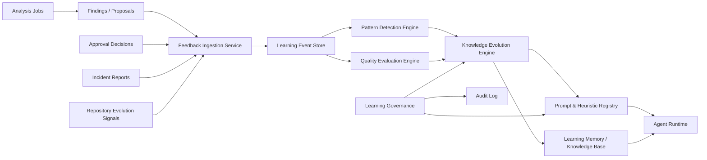

# Project-Brain Self-Improvement Framework

## Status

- Document type: production learning architecture specification
- Scope: continuous self-improvement for agent recommendations, analysis quality, and decision logic
- Constraint: no agent may modify production code automatically; all outputs remain proposals

## 1. Objective

`project-brain` must improve over time without becoming an uncontrolled self-modifying system.

The platform should learn from:

- previous analyses
- detected bugs
- failed recommendations
- human feedback
- production incidents
- repository evolution

The goal is to make future analyses:

- more precise
- less noisy
- more context-aware
- more aligned with project-specific architecture
- safer and easier to trust

This framework treats learning as controlled adaptation of:

- memory and knowledge
- heuristics
- prompts
- rule weights
- confidence scoring

It does not allow autonomous code changes or unreviewed behavior changes in production.

## 2. Learning Architecture

The self-improvement system adds a dedicated learning plane to the production architecture.

### Core learning components

- `Feedback Ingestion Service`
- `Learning Event Store`
- `Pattern Detection Engine`
- `Knowledge Evolution Engine`
- `Prompt & Heuristic Registry`
- `Quality Evaluation Engine`
- `Learning Governance Service`

### High-level responsibilities

#### Feedback Ingestion Service

- receives approval decisions
- receives explicit human feedback
- receives incident reports
- receives post-analysis outcomes
- normalizes all feedback into typed learning events

#### Learning Event Store

- stores immutable learning events
- keeps lineage to job, project, agent, finding, and recommendation
- supports replay and retrospective evaluation

#### Pattern Detection Engine

- detects repeated failure modes and recurring structural problems
- clusters similar findings across runs and repositories
- produces candidate learning signals

#### Knowledge Evolution Engine

- turns validated signals into reusable knowledge
- updates best-practice records, failure patterns, and project-specific architectural insights
- proposes prompt and heuristic refinements

#### Prompt & Heuristic Registry

- version-controls prompts, prompt fragments, tool rules, heuristics, thresholds, and scoring logic
- enables staged rollout, rollback, and A/B evaluation

#### Quality Evaluation Engine

- measures whether newer reasoning strategies improve analysis quality
- scores precision, usefulness, acceptance rate, and incident prediction value

#### Learning Governance Service

- blocks unsafe autonomous behavior changes
- requires approval for high-impact prompt or heuristic changes
- enforces rollout policies and auditability

## 3. Learning Plane Diagram



## 4. Self-Learning Loop

The system uses a controlled five-stage loop:

1. `ANALYZE`
   Agents inspect a repository and produce findings, scores, and proposals.
2. `PROPOSE`
   The system emits recommendations and optional patch proposals as non-executable artifacts.
3. `EVALUATE`
   Human approval, outcome tracking, and incident correlation determine whether the output was useful or harmful.
4. `LEARN`
   The learning subsystem extracts reusable lessons, patterns, and reliability signals.
5. `REFINE`
   Prompts, heuristics, thresholds, and rule sets are updated through governed versioned changes.

This loop is recursive across time, not within a single run. Learning updates affect future runs only after validation.

## 5. Feedback Ingestion

### 5.1 Feedback sources

The system must ingest five feedback classes:

#### Human feedback

- thumbs up / thumbs down
- free-text comments on findings
- edits to recommendations
- classification of noise vs useful insight
- reason for approval or rejection

#### Recommendation outcome feedback

- accepted proposal
- rejected proposal
- accepted but modified proposal
- ignored proposal
- proposal later linked to real defect prevention

#### Incident feedback

- postmortem
- Sev1/Sev2 incidents
- deployment rollback
- production outage
- security incident

#### Bug feedback

- bug introduced despite “clean” analysis
- bug predicted correctly by prior finding
- false-positive bug warnings
- missed regressions

#### Repository evolution feedback

- architecture changed significantly
- module ownership changed
- new framework introduced
- API style changed
- testing strategy improved or regressed

### 5.2 Feedback ingestion contracts

```ts
export interface FeedbackEvent {
  eventId: string;
  projectId: string;
  jobId?: string;
  findingId?: string;
  recommendationId?: string;
  agentId?: string;
  source:
    | "human"
    | "approval-workflow"
    | "incident-system"
    | "ci"
    | "repo-evolution"
    | "post-analysis-evaluator";
  type:
    | "recommendation.accepted"
    | "recommendation.rejected"
    | "recommendation.modified"
    | "finding.useful"
    | "finding.noisy"
    | "incident.linked"
    | "incident.missed"
    | "architecture.changed"
    | "bug.detected"
    | "bug.missed";
  severity: "low" | "medium" | "high" | "critical";
  payload: Record<string, unknown>;
  createdAt: string;
  actorId?: string;
}
```

### 5.3 Ingestion rules

- all feedback becomes immutable append-only events
- free-text feedback is preserved, but normalized labels are also required
- incident imports must preserve source system identifiers
- feedback must be linkable to the original analysis output
- missing linkage is allowed but marked as low-confidence

## 6. Learning Memory

The learning memory extends the memory system with explicit reusable knowledge categories.

### 6.1 Memory categories

#### Lessons learned

- concise statements of what worked or failed
- project-specific or global scope
- linked to evidence and outcomes

#### Failure patterns

- recurrent false positives
- recurrent false negatives
- bad prompt behaviors
- weak tool heuristics
- brittle repository assumptions

#### Architectural insights

- stable module boundaries
- known hotspot areas
- repeated coupling problems
- dependency concentration zones
- service ownership realities

#### Best practices discovered

- patterns correlated with lower incident rate
- testing strategies that reduced regressions
- observability practices that improved diagnosis
- secure defaults validated by real outcomes

### 6.2 Learning memory schema

```ts
export interface LearningRecord {
  learningId: string;
  projectId?: string;
  scope: "global" | "organization" | "project" | "repository";
  category:
    | "lesson"
    | "failure-pattern"
    | "architecture-insight"
    | "best-practice"
    | "prompt-adaptation"
    | "heuristic-adaptation";
  topic: string;
  statement: string;
  evidenceRefs: string[];
  derivedFromEventIds: string[];
  confidence: number;
  supportCount: number;
  contradictionCount: number;
  applicableAgents: string[];
  applicableTools: string[];
  tags: string[];
  status: "candidate" | "validated" | "deprecated" | "rejected";
  createdAt: string;
  updatedAt: string;
}
```

### 6.3 Learning memory requirements

- candidate learnings are separated from validated learnings
- validated learnings can influence future runs
- deprecated learnings remain queryable for audit
- every learning must be traceable to source events

## 7. Pattern Detection

The pattern engine identifies recurring signals across runs, agents, and projects.

### 7.1 Pattern classes

#### Recurring code smells

- giant service files
- low-test core modules
- circular dependencies
- dead abstractions
- duplicated business logic

#### Recurring architectural issues

- boundary violations
- hidden coupling across modules
- unstable interfaces
- service ownership ambiguity
- infra drift from documented architecture

#### Recurring security mistakes

- secret files committed
- missing lockfiles
- weak container hygiene
- unsafe auth defaults
- repeated vulnerable dependency families

#### Recurring operational incidents

- missing alerts for critical paths
- repeated rollback-triggering modules
- known hotspot services with poor telemetry
- recurring deploy failures
- insufficient runbook coverage

### 7.2 Pattern detection methods

- rule-based aggregation
- similarity clustering on findings and incidents
- temporal recurrence analysis
- diff-to-incident correlation
- acceptance/rejection ratio analysis

### 7.3 Pattern schema

```ts
export interface DetectedPattern {
  patternId: string;
  scope: "global" | "organization" | "project";
  patternType:
    | "code-smell"
    | "architecture"
    | "security"
    | "operations"
    | "feedback"
    | "recommendation-failure";
  signature: string;
  summary: string;
  frequency: number;
  impactedProjects: string[];
  firstSeenAt: string;
  lastSeenAt: string;
  confidence: number;
  evidenceRefs: string[];
  recommendedResponse: string;
}
```

## 8. Knowledge Evolution

Learning is useful only if it changes future reasoning in a controlled way.

### 8.1 Evolvable artifacts

- agent prompts
- shared prompt fragments
- severity thresholds
- confidence calibration curves
- tool rules
- project-specific heuristics
- ranking logic for recommendations

### 8.2 Evolution strategy

Knowledge evolution should happen in three steps:

1. `CANDIDATE CHANGE`
   Generated from learning records and pattern summaries.
2. `SHADOW EVALUATION`
   New prompts or heuristics run against historical jobs without affecting user-visible output.
3. `CONTROLLED ROLLOUT`
   If quality metrics improve, the new version is activated for a subset of projects or agents.

### 8.3 Prompt update model

Prompts must be modular and versioned.

Structure:

- base system prompt
- agent role prompt
- organization policy prompt
- project memory prompt
- learned heuristics prompt fragment
- execution guardrails prompt fragment

Learned prompt fragments are the only autonomously proposed prompt modifications. Promotion to active status requires evaluation and governance checks.

### 8.4 Tool rule update model

Tool rules should evolve through versioned policy packs:

- security ruleset versions
- architecture lint rule packs
- recommendation ranking rules
- confidence thresholds per agent

Rule changes are data-driven and reversible. They are not silently applied.

## 9. Model Improvement

The system should improve agent quality even when the underlying LLM does not change.

### 9.1 What gets improved

- prompt wording
- evidence selection strategy
- tool selection sequence
- reasoning depth by task type
- confidence estimation
- recommendation ranking
- false-positive suppression

### 9.2 Output evaluation dimensions

Each agent output must be scored on:

- precision
- recall proxy
- usefulness
- actionability
- clarity
- evidence quality
- acceptance rate
- incident correlation quality

### 9.3 Agent quality schema

```ts
export interface AgentQualityScore {
  scoreId: string;
  projectId: string;
  jobId: string;
  agentId: string;
  version: string;
  precisionScore: number;
  recallProxyScore: number;
  usefulnessScore: number;
  actionabilityScore: number;
  clarityScore: number;
  evidenceScore: number;
  acceptanceRateScore: number;
  incidentPredictionScore: number;
  overallScore: number;
  evaluator: "human" | "rule-engine" | "offline-benchmark";
  createdAt: string;
}
```

### 9.4 Adaptation policy

- low precision drives stricter evidence requirements
- low usefulness drives ranking and framing changes
- low acceptance drives prompt refinement and project-context weighting
- repeated misses drive new tool steps or mandatory checks
- repeated false positives reduce heuristic weight or increase threshold

## 10. Storage Model

The self-improvement framework uses a multi-store design.

### Operational storage

- PostgreSQL
  - learning events
  - learning records
  - pattern summaries
  - prompt versions
  - heuristic versions
  - quality scores
  - approval decisions

### Ephemeral processing

- Redis
  - event queues
  - temporary clustering state
  - evaluation jobs

### Artifact storage

- S3-compatible object storage
  - incident attachments
  - exported reports
  - benchmark datasets
  - shadow evaluation outputs

### Retrieval and semantic memory

- PostgreSQL + pgvector
  - learned insights
  - architectural knowledge snippets
  - prior incidents
  - accepted recommendation exemplars

### Audit storage

- append-only audit tables
- optional cold archive in object storage

## 11. Improvement Feedback Loop

The production improvement loop should operate as follows:

### Step 1: capture

- record every finding, recommendation, approval decision, and incident link

### Step 2: correlate

- link outcomes to prior jobs, agents, prompts, heuristics, repository versions, and affected components

### Step 3: score

- compute agent quality scores
- classify false positives, false negatives, and high-value recommendations

### Step 4: detect patterns

- aggregate repeated outcomes
- generate candidate learnings and failure patterns

### Step 5: propose refinements

- create candidate updates for prompts, heuristics, thresholds, and tool rules

### Step 6: validate offline

- replay historical jobs
- compare old vs candidate configurations
- block regressions before rollout

### Step 7: rollout safely

- enable by project, agent, or tenant
- monitor acceptance and precision
- rollback immediately on degradation

### Step 8: memorialize

- persist validated lessons learned and best practices into the long-term knowledge base

## 12. Learning Governance and Safety Guardrails

### Absolute guardrails

- agents cannot modify production code automatically
- agents cannot commit, push, merge, or deploy autonomously
- all suggestions remain proposals or artifacts
- prompt or heuristic changes cannot bypass governance
- unsafe rules cannot be promoted from candidate to active without evaluation

### Safety controls

- versioned prompt registry with rollback
- approval-required promotion for high-impact prompt changes
- tenant/project scoping for learned behavior
- quarantine for low-performing prompt versions
- audit log for every learning-derived change

### Recommended rollout policy

- `candidate`: not used in live runs
- `shadow`: evaluated silently against live or historical workloads
- `limited`: enabled for a subset of projects
- `active`: default for eligible projects
- `rollback`: automatically disabled due to degradation

## 13. Example Learning Events

### Example 1: accepted security recommendation

```json
{
  "eventId": "evt_001",
  "projectId": "workflow-suite",
  "jobId": "job_182",
  "findingId": "find_sec_88",
  "recommendationId": "rec_sec_17",
  "agentId": "security-agent",
  "source": "approval-workflow",
  "type": "recommendation.accepted",
  "severity": "high",
  "payload": {
    "reason": "Confirmed exposed secret in tracked .env file",
    "component": "payments-service",
    "fixAppliedByHuman": true
  },
  "createdAt": "2026-03-10T12:00:00Z",
  "actorId": "eng_manager_1"
}
```

Learning extracted:

- secret-file detection in this repository has high precision
- increase confidence weight for `.env` findings in the same project

### Example 2: rejected noisy architecture recommendation

```json
{
  "eventId": "evt_002",
  "projectId": "offroadhub",
  "jobId": "job_221",
  "findingId": "find_dev_31",
  "recommendationId": "rec_dev_09",
  "agentId": "dev-agent",
  "source": "human",
  "type": "recommendation.rejected",
  "severity": "medium",
  "payload": {
    "reason": "Suggested split was invalid because module boundary is intentional",
    "label": "false_positive_architecture_refactor"
  },
  "createdAt": "2026-03-10T12:05:00Z",
  "actorId": "staff_engineer_4"
}
```

Learning extracted:

- current refactor heuristic over-penalizes intentional shared modules
- architecture refactor suggestions require stronger ownership evidence

### Example 3: missed operational incident

```json
{
  "eventId": "evt_003",
  "projectId": "cashcalculator",
  "source": "incident-system",
  "type": "incident.missed",
  "severity": "critical",
  "payload": {
    "incidentId": "inc_44",
    "service": "pricing-api",
    "summary": "Latency spike caused by missing query timeout and absent alert",
    "relatedCommit": "ab12cd3"
  },
  "createdAt": "2026-03-10T12:20:00Z"
}
```

Learning extracted:

- observability and optimization agents missed a recurring latency risk pattern
- introduce stronger checks for query timeout configuration and alert presence

### Example 4: repository evolution signal

```json
{
  "eventId": "evt_004",
  "projectId": "workflow-suite",
  "source": "repo-evolution",
  "type": "architecture.changed",
  "severity": "low",
  "payload": {
    "change": "monolith_to_modular_monolith",
    "newModules": ["billing", "identity", "procurement"],
    "frameworksDetected": ["NestJS", "NextJS"]
  },
  "createdAt": "2026-03-10T12:40:00Z"
}
```

Learning extracted:

- previous architecture assumptions are stale
- reset architecture-specific prompt fragments for this project

## 14. Recommended Package Layout

This framework maps naturally onto the production monorepo design:

```text
packages/
  learning/
    src/
      ingestion/
      events/
      evaluation/
      patterns/
      evolution/
      governance/
      registry/
  memory/
    src/
      learnings/
      projections/
      retrieval/
  contracts/
    src/
      learning/
      feedback/
      quality/
```

## 15. Final Decision

The self-improvement framework for `project-brain` should be implemented as a governed learning subsystem that:

- ingests human and operational feedback as immutable events
- detects recurring patterns across analyses and incidents
- converts validated outcomes into reusable learning memory
- improves prompts, heuristics, and rule sets through versioned controlled rollout
- evaluates quality continuously with replay and shadow testing
- never turns learning into autonomous production code modification

This gives `project-brain` the benefits of continuous adaptation without losing auditability, safety, or human control.
